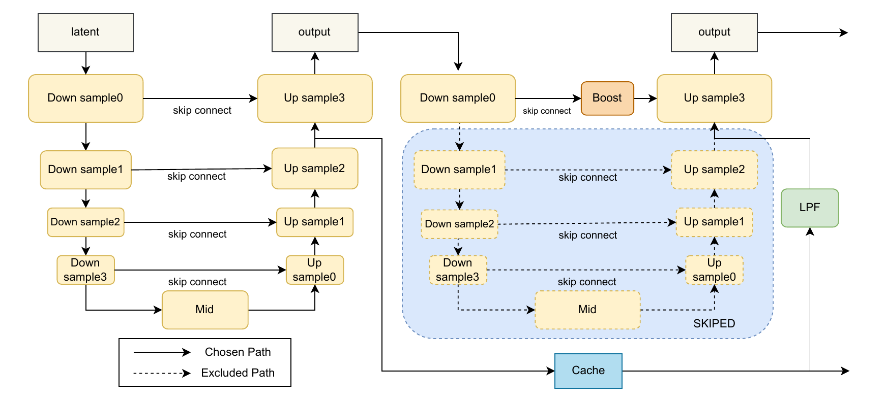

# FDDI: Frequency-Decoupled Detail Injection for Fast MimicBrush

[English](README.md) | [中文](README_zh.md)

FDDI stands for **Frequency-Decoupled Detail Injection**. It is a training-free
acceleration framework for reference-guided image editing and zero-shot
industrial defect generation. FDDI is built from the original
[MimicBrush](https://github.com/ali-vilab/MimicBrush) inference code and
integrates [DeepCache](https://github.com/horseee/DeepCache) into the
MimicBrush denoising pipeline.

Given a source image, a reference image, and a user-defined mask, FDDI uses
the reference image to synthesize a texture or appearance change in the masked
region while preserving the surrounding image. The pipeline also uses a depth
estimator, a depth guider, and ReferenceNet.

> **Research code and licensing notice:** FDDI combines several independently
> licensed software, model, and dataset components. Read the
> [license section](#license-and-third-party-terms) before redistributing the
> repository, model weights, datasets, or generated images.

## Method

### What FDDI solves

The input is a normal source image `I_src`, a reference image `I_ref` that
contains the desired defect appearance, and a binary edit mask `M`. The goal is
to transfer the reference texture into `M` while keeping the unmasked source
background unchanged. MimicBrush provides the reference-image imitation and
ReferenceNet feature injection, while the Stable Diffusion v1.5 inpainting
U-Net performs the image generation.

DeepCache accelerates diffusion by reusing deep U-Net features at neighboring
denoising steps. This is effective for stable low-frequency structure, but
directly reusing the same feature also reuses stale high-frequency texture. In
industrial images, that can make defect edges and fine surface texture blurry.

FDDI separates these two behaviors in the refinement stage. At every step, the
shallow encoder and its skip connections are freshly computed, while the deep
branch can be reused from the cache. Inside the edit mask, FDDI cleans the
cached structural signal and strengthens the fresh detail signal.

### The two FDDI streams

1. **Masked LPF, the structure stream.** Let `F_cache` be the reused deep
   feature. FDDI applies a Gaussian low-pass filter only inside `M`, then blends
   it with the original cache:

   ```text
   F_clean = (1 - alpha) * F_cache + alpha * GaussianBlur(F_cache)
   ```

   Outside the mask, the cached feature is kept unchanged to preserve the
   source background. This removes stale texture variation while retaining the
   stable structure carried by the cache.

2. **Skip Connect Booster, the texture stream.** Let `S_fresh` be the current
   step's freshly computed skip features. FDDI multiplies them by a gain only
   inside `M`:

   ```text
   S_boost = S_fresh * (1 + M * (lambda - 1))
   ```

   The paper uses `lambda = 1.4`, so current high-frequency information is
   injected into the defect region without sharpening the background.

The refinement window is defined by the diffusion timestep `t < 200` in the
1,000-step training schedule. Cross-attention remains dense so reference-image
conditioning is not discarded. The released accelerated path also contains
DynaMask sparse self-attention in this window; it is an implementation-level
runtime optimization, not a separately ablated FDDI module in the paper.

### Inference flow

1. Encode `I_ref` with the image encoder and ReferenceNet; estimate optional
   shape information with Depth Anything and Depth Guider.
2. Start the Stable Diffusion inpainting denoising process from `I_src` and
   `M`.
3. Use DeepCache with the paper's uniform 1:20 cache schedule. On cache reuse
   steps, apply Masked LPF to the reused deep feature and Skip Connect Booster
   to the fresh skip features when `t < 200`.
4. Decode the denoised latent to obtain the edited industrial image, then merge
   the generated region with the unmasked source image.

The DeepCache integration is implemented directly in the FDDI source tree. The
original and accelerated pipelines can be selected from the Gradio interface.
The default mode is DeepCache.

The paper-aligned implementation details, configuration, reported tables, and
reproduction procedure are collected in
[`docs/PAPER_REPRODUCTION.md`](docs/PAPER_REPRODUCTION.md).


**FDDI architecture.** The accelerated path reuses cached deep features,
applies Masked LPF to the refinement stream, and boosts fresh skip-connection
features inside the edit mask.



## Repository layout

```text
FDDI/
  app.py                                  Gradio demo
  fddi_config.py                          Paper-aligned default settings
  models/                                 MimicBrush pipelines and ReferenceNet
  mimicbrush/                             Reference-image feature wrapper
  DeepCache/                              Vendored DeepCache implementation
  depthanything/                          Depth Anything and DINOv2 code
  examples/                               Small source/reference examples
  scripts/check_assets.py                 Runtime asset validation
  scripts/smoke_inference.py              Deterministic FDDI smoke test
  DeepCache/stable_diffusion_inpaint.py   Baseline/DeepCache comparison demo
  docs/ASSET_LAYOUT.md                    External asset layout
  LICENSE                                 Apache-2.0 for original FDDI code
```

Large runtime assets are intentionally kept outside the Git repository:

- Model weights and checkpoints
- Complete benchmark datasets
- FID and other temporary caches
- Large-scale generated images and evaluation results

This keeps the source repository suitable for GitHub while preserving the
complete research assets on the runtime server. See
[`docs/ASSET_LAYOUT.md`](docs/ASSET_LAYOUT.md).

## Tested environment

The current implementation has been tested in the following environment:

- Python 3.10
- PyTorch 2.8.0 with CUDA
- Diffusers 0.24.0
- Transformers 4.26.1
- Gradio 4.44.1
- NVIDIA GPU with 16 GB memory

## Installation

```bash
conda activate mimicbrush
pip install -r requirements.txt
```

ModelScope is optional when all models are available locally. To enable the
online fallback used by `app.py`, install the additional dependency:

```bash
pip install -r requirements-modelscope.txt
```

## Runtime assets

Set `FDDI_ASSET_ROOT` to the directory containing the external FDDI assets:

```bash
export FDDI_ASSET_ROOT=/path/to/FDDI_assets
python scripts/check_assets.py
```

The expected layout is:

```text
FDDI_assets/
  models/modelscope/xichen/MimicBrush/
  models/modelscope/xichen/cleansd/
  datasets/VisA/
  datasets/KolektorSDD2/
  datasets/BTAD/                 optional, if used by experiments
  results/mvtec/
  results/mvtec_new/
  results/VisA/
  cache/temp_fid_crops/
```

The standard FDDI model paths are:

```text
models/modelscope/xichen/MimicBrush/mimicbrush/mimicbrush.bin
models/modelscope/xichen/MimicBrush/sd-vae-ft-mse/
models/modelscope/xichen/MimicBrush/image_encoder/
models/modelscope/xichen/MimicBrush/depth_model/depth_anything_vitb14.pth
models/modelscope/xichen/cleansd/stable-diffusion-inpainting/
models/modelscope/xichen/cleansd/stable-diffusion-v1-5/
```

The repository does not require a machine-specific absolute path. When the
asset directory is next to the source checkout, `run_fddi.sh` discovers it
automatically.

## Run the Gradio demo

```bash
./run_fddi.sh
```

The demo binds to `0.0.0.0:7860` and uses DeepCache by default. The interface
also provides a button for switching to the original MimicBrush pipeline.

Basic workflow:

1. Upload a source image.
2. Draw the region to edit on the source image.
3. Upload a reference image.
4. Click **Run**.
5. Enable shape control when a texture transfer should preserve the original
   depth/shape structure.

The research demo disables the safety checker to match the original inference
setup. Do not expose unfiltered model output as a public service without
adding application-level safety controls.

## Run a deterministic smoke test

The smoke test runs one FDDI generation without starting Gradio:

```bash
python scripts/check_assets.py
python scripts/smoke_inference.py --steps 10 --seed 42
```

The output is written to:

```text
FDDI_assets/results/smoke_test/fddi_deepcache_smoke.png
```

You can choose another output path:

```bash
python scripts/smoke_inference.py \
  --steps 10 \
  --seed 42 \
  --output FDDI_assets/results/smoke_test/example.png
```

## Compare standard inpainting and DeepCache

The vendored comparison script accepts explicit input paths and does not rely
on a research-server directory:

```bash
python DeepCache/stable_diffusion_inpaint.py \
  --image path/to/image.png \
  --mask path/to/mask.png \
  --prompt "a photo of a scratch" \
  --model runwayml/stable-diffusion-inpainting \
  --output output1.png
```

This script requires the selected model to be available locally or through the
Hugging Face cache. It writes a side-by-side baseline/DeepCache comparison.

## Reproducibility notes

- Use the same seed, source image, reference image, mask, scheduler, and
  inference settings when comparing the two pipelines.
- The FDDI smoke test uses the external MimicBrush and Stable Diffusion assets;
  it does not download model weights into the source repository.
- The current smoke test verifies successful generation and DynaMask
  installation. It is not a formal speed or quality benchmark.
- Bulk MVTec and VisA outputs remain in the external `results/` directory and
  are not committed to GitHub.
- The paper reports MVTec/VisA quality and timing tables; see
  [`docs/PAPER_REPRODUCTION.md`](docs/PAPER_REPRODUCTION.md) for the exact
  values, metric directions, and the GFLOPs accounting note.
- DynaMask sparse self-attention is included as an implementation-level
  runtime optimization. It was not separately reported in the paper ablation
  table, so new benchmark claims should be rerun after changing this path.

## License and third-party terms

### Original FDDI code

Original FDDI contributions are provided under the Apache License 2.0 in the
top-level [`LICENSE`](LICENSE), unless a file or subdirectory contains a more
specific third-party notice. The top-level license does not relicense any
third-party model, dataset, checkpoint, or image.

### DeepCache

FDDI vendors and adapts the DeepCache source under [`DeepCache/`](DeepCache/).
The main DeepCache source is distributed under Apache License 2.0; retain
[`DeepCache/LICENSE`](DeepCache/LICENSE) when copying or redistributing this
source tree.

When distributing modified DeepCache-derived source, follow the Apache-2.0
conditions, including:

- Retain the copyright, attribution, patent, and license notices.
- Include a copy of the applicable Apache License.
- Mark files that have been modified.
- Do not imply endorsement or grant rights to DeepCache trademarks.

The optional code under `DeepCache/experiments/ldm/` has its own MIT license in
[`DeepCache/experiments/ldm/LICENSE`](DeepCache/experiments/ldm/LICENSE).
`DeepCache/DeepCache/flops.py` also contains an in-file MIT attribution for
adapted FLOPs-counter code. File-level notices remain applicable.

DeepCache paper:

```bibtex
@inproceedings{ma2023deepcache,
  title={DeepCache: Accelerating Diffusion Models for Free},
  author={Ma, Xinyin and Fang, Gongfan and Wang, Xinchao},
  booktitle={The IEEE/CVF Conference on Computer Vision and Pattern Recognition},
  year={2024}
}
```

### MimicBrush and related source

FDDI is based on the upstream
[MimicBrush repository](https://github.com/ali-vilab/MimicBrush), which is
licensed separately. The upstream repository and its attribution should be
retained when redistributing derivative source.

MimicBrush paper:

```bibtex
@article{chen2024mimicbrush,
  title={Zero-shot Image Editing with Reference Imitation},
  author={Chen, Xi and Feng, Yutong and Chen, Mengting and Wang, Yiyang and Zhang, Shilong and Liu, Yu and Shen, Yujun and Zhao, Hengshuang},
  journal={arXiv preprint arXiv:2406.07547},
  year={2024}
}
```

The MimicBrush implementation also acknowledges IP-Adapter and MagicAnimate.
Their source and license terms must be respected where applicable.

### Depth Anything and DINOv2

The depth estimation code and bundled DINOv2 code are third-party components.
Review the license files under
[`depthanything/`](depthanything/), especially the DINOv2 subtree at
`depthanything/torchhub/facebookresearch_dinov2_main/`. That subtree includes
the Creative Commons Attribution-NonCommercial 4.0 International license.
This may restrict commercial use of the affected code or models.

### Models, datasets, and generated images

The following assets are external to the source-code license and retain their
own terms:

- MimicBrush checkpoints from ModelScope or Hugging Face
- Stable Diffusion v1.5 and inpainting checkpoints
- VisA, KolektorSDD2, BTAD, and MVTec data
- Reference images and bulk-generated result images

Check the original model cards, dataset licenses, and image rights before
redistribution or commercial use. Do not upload these assets to GitHub merely
because the source code is Apache-2.0 licensed.

## Acknowledgements

This work builds on MimicBrush, DeepCache, Diffusers, Depth Anything, DINOv2,
IP-Adapter, and MagicAnimate. Please cite the relevant upstream works and keep
their license files and attribution notices with any redistribution.
