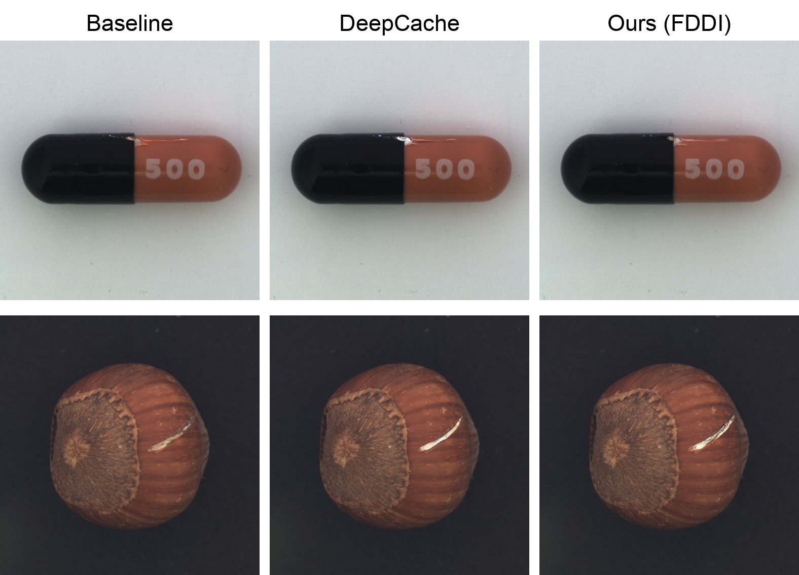

# FDDI：基于 DeepCache 的快速 MimicBrush

[English](README.md) | 中文

FDDI 是一个用于参考图像引导编辑和工业异常图像生成的科研实现。项目
直接基于原始
[MimicBrush](https://github.com/ali-vilab/MimicBrush) 推理代码，并将
[DeepCache](https://github.com/horseee/DeepCache) 集成到 MimicBrush 的
扩散去噪流程中。

给定源图像、参考图像和用户绘制的掩码，FDDI 使用参考图像在掩码区域内
合成纹理或外观变化，同时尽量保持未编辑区域。整个流程还使用深度估计器、
Depth Guider 和 ReferenceNet。

> **科研代码和协议说明：** FDDI 包含多个具有独立许可证的软件、模型和
> 数据集组件。在重新分发代码、模型权重、数据集或生成图片前，请务必阅读
> [协议和第三方条款](#协议和第三方条款)。

## 方法概述

FDDI 的主要组成部分如下：

- MimicBrush 的参考图像模仿和 ReferenceNet 特征注入。
- 在扩散去噪过程中复用 DeepCache 特征。
- 在 refinement 阶段使用 DynaMask 加速自注意力。
- 保持交叉注意力的完整计算，以保留参考图像和文本提示信息。
- 使用 Depth Anything 和 Depth Guider 实现可选的形状控制。

DeepCache 集成代码直接保存在 FDDI 源码树中。Gradio 界面可以在原始
MimicBrush 管线和加速管线之间切换，默认使用 DeepCache。

论文对应的实现细节、统一配置、论文中报告的结果表和复现流程见
[`docs/PAPER_REPRODUCTION.md`](docs/PAPER_REPRODUCTION.md)。论文作者为
周树帆、孙铭杰，单位为苏州大学计算机科学与技术学院。

从整体上看，FDDI 在精细化阶段 `t < 200` 将缓存的结构流与当前步的细节
特征分开处理：掩码引导的 LPF 只清洗编辑区域内的缓存特征，Skip Connect
Booster 则增强同一区域的新鲜跳跃连接特征。论文配置为 40 步 DDIM、均匀
1:20 缓存策略、LPF `(kernel=3, sigma=0.8, alpha=0.5)` 和 Booster 系数
`1.4`。



## 仓库结构

```text
FDDI/
  app.py                                  Gradio 演示程序
  fddi_config.py                          与论文对齐的默认配置
  models/                                 MimicBrush 管线和 ReferenceNet
  mimicbrush/                             参考图像特征处理封装
  DeepCache/                              内置的 DeepCache 实现
  depthanything/                          Depth Anything 和 DINOv2 代码
  examples/                               小型源图像和参考图像示例
  scripts/check_assets.py                 运行时资源检查
  scripts/smoke_inference.py              确定性的 FDDI 冒烟测试
  DeepCache/stable_diffusion_inpaint.py   标准管线与 DeepCache 对比脚本
  docs/ASSET_LAYOUT.md                    外部资源目录说明
  LICENSE                                 项目级 Apache-2.0 协议文本
```

以下大型运行时资源被有意放在 Git 仓库之外：

- 模型权重和检查点
- 完整的评测数据集
- FID 等临时缓存
- 大批量生成图片和评测结果

这样可以让源码仓库适合上传 GitHub，同时保留服务器上的完整科研资产。
具体目录结构见 [`docs/ASSET_LAYOUT.md`](docs/ASSET_LAYOUT.md)。

## 已测试环境

当前版本已在以下环境中测试：

- Python 3.10
- PyTorch 2.8.0 with CUDA
- Diffusers 0.24.0
- Transformers 4.26.1
- Gradio 4.44.1
- 16 GB 显存的 NVIDIA GPU

科研服务器使用的 Conda 环境名称为 `mimicbrush`。

## 安装

```bash
conda activate mimicbrush
pip install -r requirements.txt
```

当所有模型都已准备在本地时，ModelScope 是可选依赖。如果需要启用
`app.py` 中的在线下载后备方式，可以额外安装：

```bash
pip install -r requirements-modelscope.txt
```

## 运行时资源

将 `FDDI_ASSET_ROOT` 设置为外部 FDDI 资源目录：

```bash
export FDDI_ASSET_ROOT=/path/to/FDDI_assets
python scripts/check_assets.py
```

预期目录结构如下：

```text
FDDI_assets/
  models/modelscope/xichen/MimicBrush/
  models/modelscope/xichen/cleansd/
  datasets/VisA/
  datasets/KolektorSDD2/
  datasets/BTAD/                 可选，按实验需要准备
  results/mvtec/
  results/mvtec_new/
  results/VisA/
  cache/temp_fid_crops/
```

FDDI 使用的主要模型路径如下：

```text
models/modelscope/xichen/MimicBrush/mimicbrush/mimicbrush.bin
models/modelscope/xichen/MimicBrush/sd-vae-ft-mse/
models/modelscope/xichen/MimicBrush/image_encoder/
models/modelscope/xichen/MimicBrush/depth_model/depth_anything_vitb14.pth
models/modelscope/xichen/cleansd/stable-diffusion-inpainting/
models/modelscope/xichen/cleansd/stable-diffusion-v1-5/
```

源码不依赖特定服务器的绝对路径。如果资源目录位于源码仓库旁边，
`run_fddi.sh` 会自动发现它。

## 运行 Gradio 演示

```bash
./run_fddi.sh
```

演示程序默认监听 `0.0.0.0:7860`，并使用 DeepCache。界面中的按钮可以
切换到原始 MimicBrush 管线。

基本使用流程：

1. 上传源图像。
2. 在源图像上绘制需要编辑的区域。
3. 上传参考图像。
4. 点击 **Run**。
5. 如果希望进行纹理迁移并尽量保持原始深度和形状结构，开启形状控制。

为了匹配原始科研推理设置，当前演示程序关闭了 safety checker。不要在没有
额外安全控制的情况下，将未过滤的模型输出直接作为公共服务提供。

## 运行确定性冒烟测试

冒烟测试可以在不启动 Gradio 的情况下执行一次 FDDI 生成：

```bash
python scripts/check_assets.py
python scripts/smoke_inference.py --steps 10 --seed 42
```

默认输出位置为：

```text
FDDI_assets/results/smoke_test/fddi_deepcache_smoke.png
```

也可以指定其他输出路径：

```bash
python scripts/smoke_inference.py \
  --steps 10 \
  --seed 42 \
  --output FDDI_assets/results/smoke_test/example.png
```

## 对比标准管线和 DeepCache

内置的对比脚本使用显式输入路径，不依赖科研服务器的目录：

```bash
python DeepCache/stable_diffusion_inpaint.py \
  --image path/to/image.png \
  --mask path/to/mask.png \
  --prompt "a photo of a scratch" \
  --model runwayml/stable-diffusion-inpainting \
  --output output1.png
```

该脚本要求指定模型已经在本地或 Hugging Face 缓存中。输出为标准管线和
DeepCache 结果的并排对比图。

## 复现说明

- 对比两个管线时，应保持随机种子、源图像、参考图像、掩码、调度器和推理
  参数一致。
- FDDI 冒烟测试使用外部的 MimicBrush 和 Stable Diffusion 资源，不会把模型
  权重下载到源码仓库中。
- 当前冒烟测试用于验证生成成功和 DynaMask 安装，不是正式的速度或质量
  基准测试。
- MVTec 和 VisA 的大批量结果保留在外部 `results/` 目录，不提交到 GitHub。
- 论文中的 MVTec/VisA 质量与耗时表、GFLOPs 统计口径和全部复现参数见
  [`docs/PAPER_REPRODUCTION.md`](docs/PAPER_REPRODUCTION.md)。
- 加速管线中还包含 DynaMask 稀疏自注意力，这是实现层的运行时优化；论文
  消融表没有将其单独报告为组件。修改该路径后，需要重新跑基准，不能直接
  沿用论文数字。

## 引用

```bibtex
@misc{zhou2026fddi,
  title  = {面向零样本工业缺陷生成的频率解耦细节注入加速网络},
  author = {Shufan Zhou and Mingjie Sun},
  year   = {2026},
  note   = {Research manuscript, Soochow University}
}
```

## 协议和第三方条款

### FDDI 原创代码

在没有更具体的第三方声明时，FDDI 的原创贡献使用仓库根目录中的
Apache License 2.0，即 [`LICENSE`](LICENSE)。根目录许可证不会重新授权
任何第三方模型、数据集、检查点或图片。

GitHub 根目录的 Apache-2.0 主要表示项目原创代码的协议。不能据此认为
仓库中的所有文件、模型权重和数据集都自动变成 Apache-2.0。

### DeepCache

FDDI 在 [`DeepCache/`](DeepCache/) 中内置并改造了 DeepCache 源码。DeepCache
主体使用 Apache License 2.0，重新分发源码时应保留
[`DeepCache/LICENSE`](DeepCache/LICENSE)。

如果重新分发修改后的 DeepCache 衍生源码，需要遵守 Apache-2.0 的主要要求：

- 保留版权、归属、专利和许可证声明。
- 附带适用的 Apache License 副本。
- 对被修改的文件作出明确说明。
- 不得暗示 DeepCache 项目为你的产品或服务背书，也不得擅自使用其商标。

`DeepCache/experiments/ldm/` 下的实验代码有单独的 MIT 许可证，见
[`DeepCache/experiments/ldm/LICENSE`](DeepCache/experiments/ldm/LICENSE)。
此外，`DeepCache/DeepCache/flops.py` 文件内包含改写自 FLOPs-counter 代码的
MIT 归属声明。以文件内的许可证和归属声明为准。

DeepCache 论文引用：

```bibtex
@inproceedings{ma2023deepcache,
  title={DeepCache: Accelerating Diffusion Models for Free},
  author={Ma, Xinyin and Fang, Gongfan and Wang, Xinchao},
  booktitle={The IEEE/CVF Conference on Computer Vision and Pattern Recognition},
  year={2024}
}
```

### MimicBrush 及相关代码

FDDI 基于上游
[MimicBrush 仓库](https://github.com/ali-vilab/MimicBrush)，其代码和归属信息
需要遵守上游仓库的独立条款。重新分发衍生代码时，应保留上游归属和许可证。

MimicBrush 论文引用：

```bibtex
@article{chen2024mimicbrush,
  title={Zero-shot Image Editing with Reference Imitation},
  author={Chen, Xi and Feng, Yutong and Chen, Mengting and Wang, Yiyang and Zhang, Shilong and Liu, Yu and Shen, Yujun and Zhao, Hengshuang},
  journal={arXiv preprint arXiv:2406.07547},
  year={2024}
}
```

MimicBrush 的实现还参考并致谢 IP-Adapter 和 MagicAnimate。涉及这些项目的
源码时，需要同时遵守其许可证和归属要求。

### Depth Anything 和 DINOv2

深度估计代码和仓库中内置的 DINOv2 代码属于第三方组件。请阅读
[`depthanything/`](depthanything/) 下的许可证文件，尤其是
`depthanything/torchhub/facebookresearch_dinov2_main/` 子目录。该子目录
包含 Creative Commons Attribution-NonCommercial 4.0 International 许可证，
可能限制相关代码或模型的商业使用。

### 模型、数据集和生成图片

以下资源不属于 FDDI 源代码许可证的授权范围，各自保留原始条款：

- ModelScope 或 Hugging Face 上的 MimicBrush 权重
- Stable Diffusion v1.5 和 inpainting 权重
- VisA、KolektorSDD2、BTAD 和 MVTec 数据
- 参考图像以及批量生成的结果图片

在重新分发或用于商业用途前，请检查原始模型卡、数据集许可证和图片版权。
不要因为源码使用 Apache-2.0，就直接将这些资源上传到 GitHub 或用于商业用途。

## 致谢

本项目基于 MimicBrush、DeepCache、Diffusers、Depth Anything、DINOv2、
IP-Adapter 和 MagicAnimate。重新分发时，请引用相关上游工作，并保留它们
的许可证文件和归属声明。
